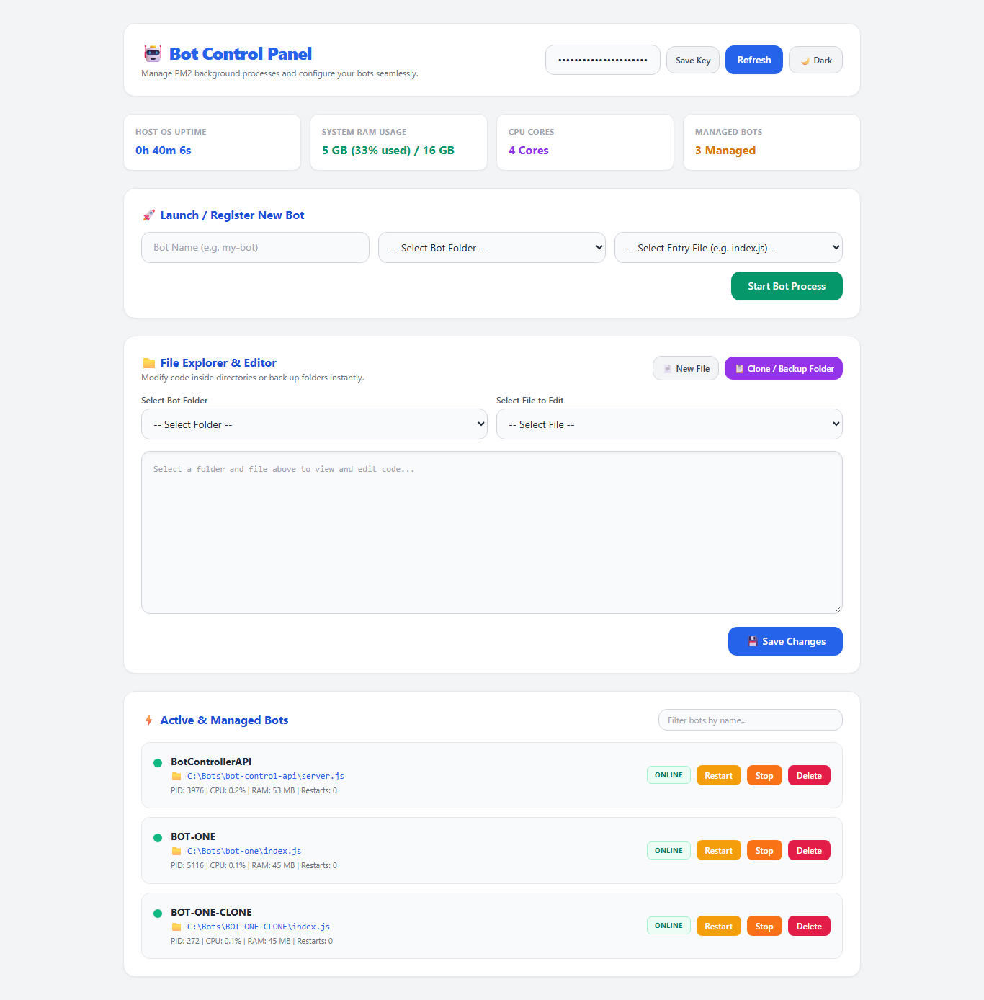

```markdown
# 🤖 Node.js Bot Control Panel for Windows and VPS

A powerful, self-hosted web control panel designed to monitor, manage, and orchestrate multiple Node.js bots and background processes from a single sleek dashboard. Built using Express.js, Tailwind CSS, and PM2.

---

## ✨ Features & Capabilities

- **⚡ Centralized Bot Management**: Start, stop, restart, or delete any Node.js bot instance instantly.
- **🚀 Quick Launch Dropdown**: Effortlessly register and spin up new bot processes by selecting project folders and entry files directly from the UI.
- **📁 Integrated File Explorer & Editor**: Browse project directories, view and modify source code or configurations live in your browser, create new files, and instantly backup/clone folders.
- **📊 Real-Time System Monitoring**: Keep track of Host OS system uptime, RAM consumption, CPU core counts, and active bot processes.
- **🌙 Dark & Light Mode Toggle**: Seamlessly switch between light mode (default white) and dark mode with preferences saved automatically.
- **🔒 Secure API Key Authentication**: Protect your control panel backend endpoints using custom API headers.

---

## 🛠️ Step-by-Step Installation & Setup Guide

Follow these instructions to set up and run your bot control panel on your system or server.

### Step 1: Install PM2 Globally
To keep your Node.js control panel and bots running continuously in the background, install PM2 globally via npm:
```bash
npm install -g pm2

```

### Step 2: Clone the Repository

Clone your project repository from GitHub and navigate into the workspace:

```bash
git clone https://github.com/zaidbscs/NODEJS-BOT-CONTROL-PANEL.git
cd NODEJS-BOT-CONTROL-PANEL

```

### Step 3: Navigate to the Server Folder & Initialize

Go into the control panel folder (`bot-control-ap`) and initialize the package configuration:

```bash
cd bot-control-ap
npm init -y
npm install express body-parser cors pm2  # (or install your project dependencies)

```

### Step 4: Start the Control Panel Server via PM2

Launch the control panel backend (`server.js`) using PM2 under the name `bot-control-ap`:

```bash
pm2 start server.js --name "bot-control-ap"

```

To make sure your control panel restarts automatically if your system reboots:

```bash
pm2 startup
pm2 save

```

---

## 🖥️ Using the Control Panel Dashboard

1. **Open the Interface:**
Open the `index.html` file in Google Chrome or any modern web browser (or access it via your server URL/localhost endpoint).
2. **Authenticate:**
Enter your API Key in the top header configuration box and click **Save Key** to unlock full dashboard privileges.
3. **Control & Manage Bots:**
* Use the **Quick Launch** section to register new bots by selecting their target folder and entry script (`index.js`).
* Monitor real-time statuses, CPU/RAM usage, and restart counts in the **Active & Managed Bots** grid.
* Use the **File Explorer & Editor** to inspect and update your code on the fly.


---

## 📋 Useful PM2 Commands

* **Check status of control panel and bots:**
```bash
pm2 status

```


* **View real-time logs:**
```bash
pm2 logs bot-control-ap

```


* **Restart the control panel server:**
```bash
pm2 restart bot-control-ap

```


* **Stop the control panel server:**
```bash
pm2 stop bot-control-ap

```


---

## 📄 License

This project is open-source and available under the [MIT License](https://www.google.com/search?q=LICENSE).

```

```
